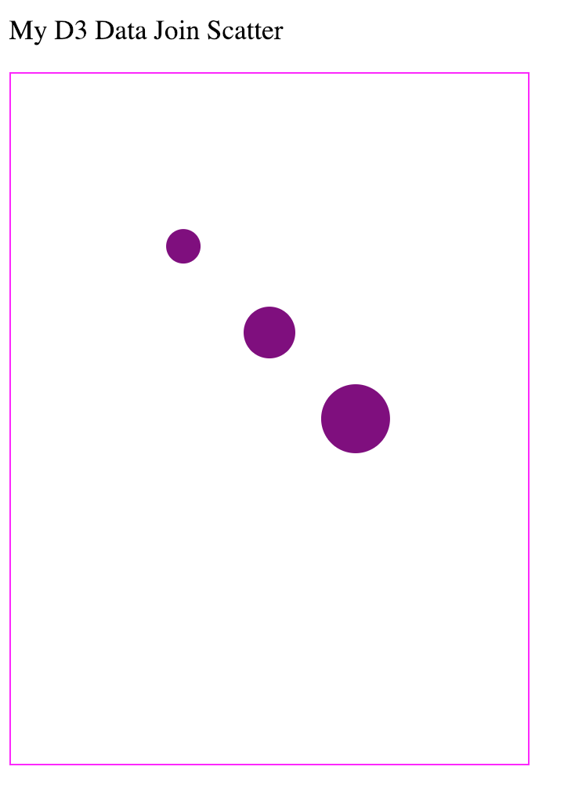

## Lab 3
This is an exercise to practice manipulating the DOM D3 using the **data-join**. The final example should look like the image below. (You can also see a completed example [here](https://codepen.io/molliemarie/pen/RqmyaW).)



You'll want to open up your `index.html` file in a text editor, and then perform the following steps (instructions are also in the file). All steps will be completed using d3.js, and should be completed in the `<script>` section at the bottom of the `index.html` file. Preliminary steps have been completed for you.

- Append 3 `circle` elements inside of your `<svg>` **using the data join**. To do this, you'll use the following syntax:

```js
// Select all circles in the svg and bind your data to the selection
var circles = svg.selectAll('circle')

// Determine what's new to the screen using `.enter()` and for each new element, append a circle
// Then, use the data provided to set the desired attributes
circles.enter()
    .append('circle')
    .attr('cx', function(d) { return d.cx})
    .attr('cy', function(d) { return d.cy})
    .attr('r', function(d){return d.r})

```
    - `cx`: How far to move the circles in the `x` direction (right). Should be 100, 150, and 200. 
    - `cy`: How for to move the circle in the `y` direction (down from the top). Should be 100, 150, and 200. 
    - `r`: circle radius. Should be 10, 15, and 20.
