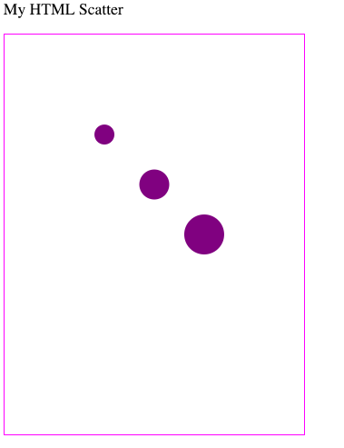

# Creating a "scatter plot" using html

This is an exercise to practice basic HTML, SVG, and CSS syntax. It is also designed to demonstrate that something that _looks like_ a chart on a website is actually just a collection of simple HTML elements. The final example should look like this (you can also see the `complete.html` file for answers):

You'll want to open up your `index.html` file in a text editor, and then perform the following steps (instructions are also in the file):

- Make a container `
` in which you'll render your content 
- Create a `
` element in which you write "My Bar Chart" 
- Make a container `<svg>` element in which you'll place your rectangles 
- Set your svg's `width` to 300, and `height` to `400` 
- Put 3 `<rect>` elements inside of your `<svg>`, setting the properties for each one: 
    - `x`: How far to move the rectangle in the `x` direction (right). Should be `0` for all rectangles. 
    - `y`: How for to move the rect in the `y` direction (down from the top). Should be `10`, `40` `70` 
    - `width`: How far to draw the rectangle to the right. Should be `100`,`200`, `300` 
    - `height`: The vertical height of each rectangle. Should be `20` for all rectangles 

- In the `<style>` section, set `rect` elements to have a "fill" of whatever color you like.